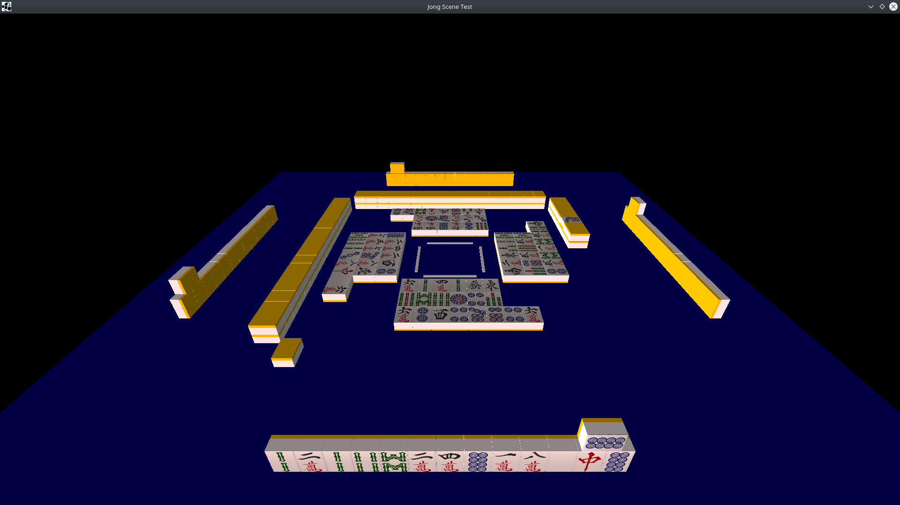
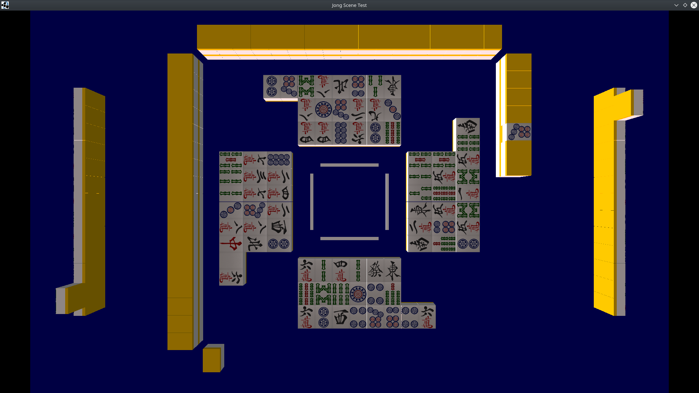
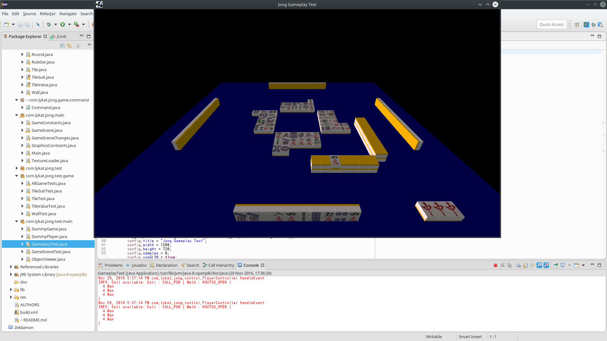

Jong
====

A (real) Mahjong game written in Java.

Features
--------

So far the game is able to render a 3D scene representing the current game
state. This is seen when running the `GameSceneTest` class:

The `GameplayTest` class tests the runthrough of a game, allowing the player
to draw, discard, and call tiles. This is still in development and has known
bugs, including cases of the game reaching an illegal state, and (as can be
observed in the screenshot below) too many of each tile being pulled from the
wall.

Controls
--------

 - The top row of the keyboard from `1` to `BACKSPACE` discard the
 corresponding tile in the player's hand
 - `F` discards the tile the player draw (*tsumogiri*)
 - `S` to call *PON* when available
 - `D` to skip available tile call(s)
 - `O` to confirm any other dialogues

Compilation
-----------

Compile by executing the `ant` command. This will build a number of runnable
JAR files to the `dist/` directory. As of writing, the main JAR `Jong.jar`
does not function, but the two test JARs do produce visual output.

Dependencies
------------
- JDK 1.7+
- [LibGDX 1.6.1](https://libgdx.badlogicgames.com/releases/)

The following LibGDX jars are required to build the project, and should be
placed in the `lib` folder at the root of the project directory:

- gdx.jar
- gdx-natives.jar
- gdx-backend-lwjgl.jar
- gdx-backend-lwjgl-natives.jar

Acknowledgements
----------------
Many thanks to Martin Persson at http://www.martinpersson.org for the tile
textures.

